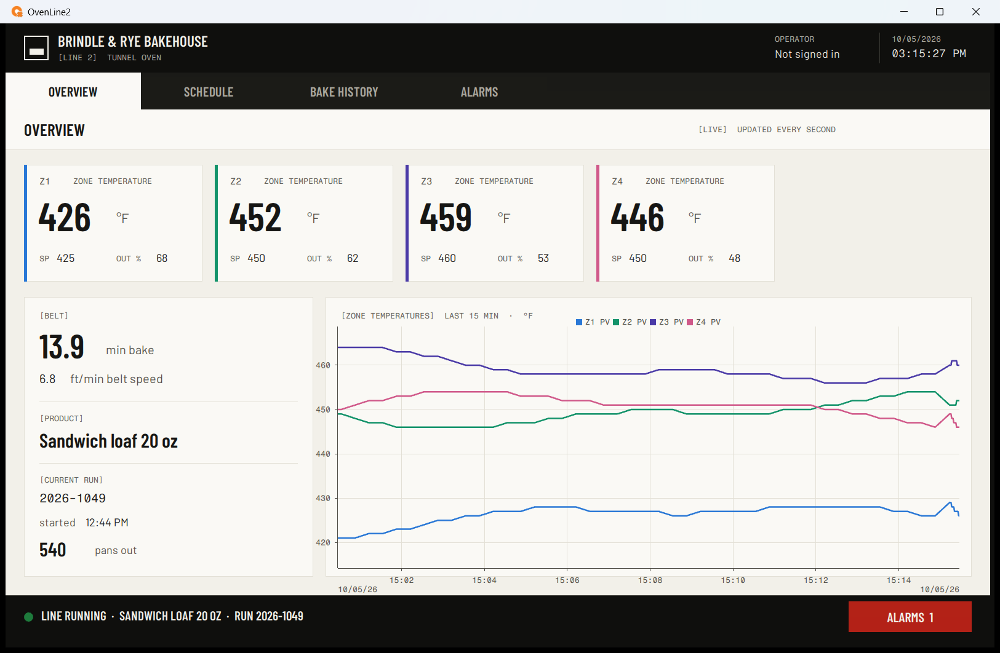
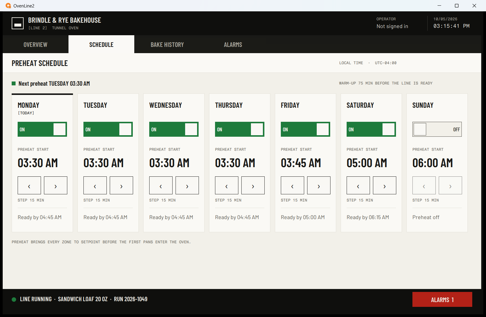
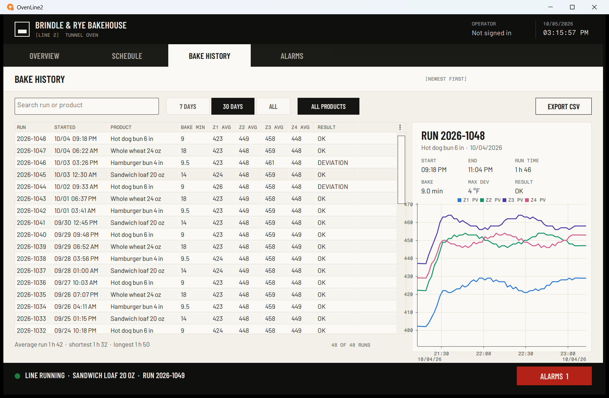

# OvenLine2: a sample FactoryTalk Optix project

A small, public FactoryTalk Optix 1.7.3 project: the HMI of a fictional industrial bakery's tunnel
oven, Line 2 at *Brindle & Rye Bakehouse*; the project, `OvenLine2`, is named after that line. It is
the sample project Pilotello runs on in its demos and tests. Everything in it is invented: the bakery,
the products, the data.



## Screens

| Screen | What it shows |
|---|---|
| OVERVIEW | Zone tiles (temperature, setpoint, burner output), belt, product, current run, live trend of the last 15 minutes |
| SCHEDULE | Weekly preheat: one card per day with an on/off switch, the start time in 15-minute steps and the "ready by" time |
| BAKE HISTORY | Search, date and product filters, the run grid, the selected run's detail and zone curves, CSV export, run-time statistics |
| ALARMS | The three alarm conditions and their state; the footer button turns red while one is active |




## How it works

- **No controller.** A NetLogic simulation (`OvenSimulation`) stands in for the PLC: it drives the five
  oven zones, the belt, the run and the alarm conditions. There is no communication driver.
- **History.** A SQLite store holds the bake runs (`BakeRuns`) and the zone temperature log
  (`OvenLogger`, written every two seconds). On a fresh database, `RunJournal` writes 48 runs over the
  last 30 days, relative to today, so the history screen always has recent rows.
- **Schedule.** The schedule is retained across restarts.
- **Look.** Colours, fonts and shapes come from one style sheet. The fonts are Barlow, Barlow Condensed
  and Fragment Mono (SIL Open Font License, in `fonts/` and `ProjectFiles/Font/`).

## The deliberate gap

Zone 5 is commissioned in the model, and the simulation drives it. The HMI shows zones 1 to 4 only:
no tile, no trend pens, no logging, no history column. Extending the HMI to zone 5 exactly like its
siblings is the task this project is built for.

## Build

The project is generated, not edited by hand. `build_fixture.py` runs the official CLI
(`FTOptixStudio.com new`), then writes the content with `optixgen.py`. Node Ids derive from names, so
two builds on the same machine give identical trees.

```
python build_fixture.py [--out OvenLine2] [--studio DIR] [--skeleton DIR] [--theme exploded|plain]
```

`--theme plain` writes the same model and logic with a basic, unstyled UI.

Requires FactoryTalk Optix Studio 1.7.3 on Windows and Python 3.10+, standard library only. Open
the project in Studio or export it with the CLI. The Runtime runs without a licence for 120 minutes.

## Licence

MIT (see `LICENSE`). Fonts: SIL Open Font License 1.1 (see `fonts/OFL-*.txt`).
FactoryTalk and Optix are trademarks of Rockwell Automation, Inc.; this project is not affiliated
with or endorsed by Rockwell Automation.
